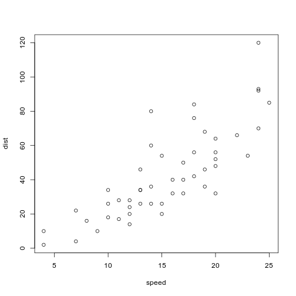

RiboViz Project
========================================================
author: Flic Anderson
date: 04 Mar 2020
autosize: true
#font-import: https://fonts.googleapis.com/css?family=Telex
font-family: 'Telex'


<small> This presentation at: [bit.ly/LabTalk-RiboViz](http://bit.ly/LabTalk-RiboViz)</small>

<small> GitHub: [@FlicAnderson](https://github.com/FlicAnderson/)</small>


First Slide
========================================================

For more details on authoring R presentations please visit <https://support.rstudio.com/hc/en-us/articles/200486468>.

- Bullet 1
- Bullet 2
- Bullet 3


Slide With Code
========================================================


```r
summary(cars)
```

```
     speed           dist       
 Min.   : 4.0   Min.   :  2.00  
 1st Qu.:12.0   1st Qu.: 26.00  
 Median :15.0   Median : 36.00  
 Mean   :15.4   Mean   : 42.98  
 3rd Qu.:19.0   3rd Qu.: 56.00  
 Max.   :25.0   Max.   :120.00  
```


Slide With Image Left
====================================

***
This text will appear to the right


Slide With Plot
========================================================




Last Slide
========================================================
title: false

# Questions?


***
This text will appear to the right

Talk slides online at:
[bit.ly/LabTalk-RiboViz](http://bit.ly/LabTalk-RiboViz)

RiboViz code online at: 
[github.com/riboviz/RiboViz/](https://github.com/riboviz/RiboViz/)
